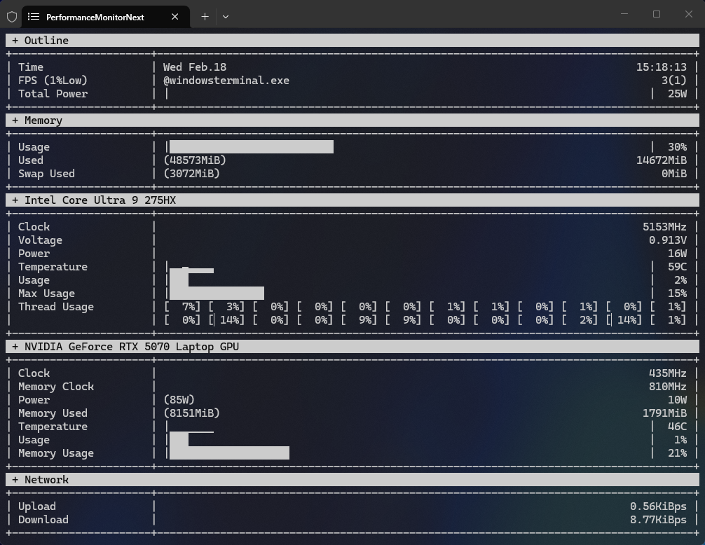
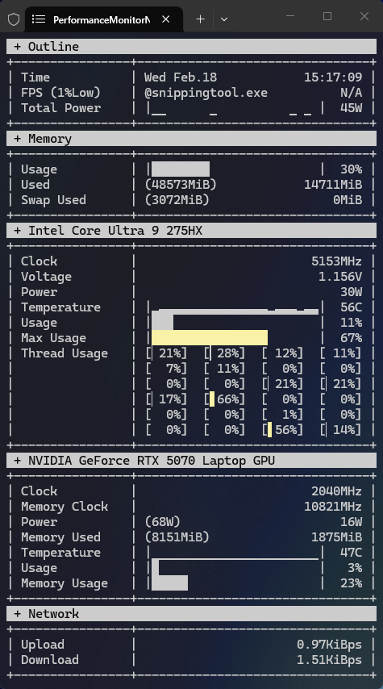

# Performance Monitor Next

A lightweight, real-time system performance monitoring tool for Windows, built with Python. It provides detailed insights into your hardware's status directly in the terminal.

## Features

- **CPU Monitoring**: Real-time tracking of CPU temperature, clock speed, usage, load, voltage, and power consumption.
- **GPU Monitoring**:
  - Supports general GPU monitoring via LibreHardwareMonitor.
  - Dedicated support for NVIDIA GPUs using NVML for detailed metrics.
- **Memory Monitoring**: Tracks physical memory and swap memory usage.
- **Network Monitoring**: Monitors network activity.
- **Real-time Updates**: continuously updates the display with configurable refresh rates.
- **CLI Interface**: Simple and efficient command-line interface.

## Requirements

- **Operating System**: Windows (due to `LibreHardwareMonitor` and `pythonnet` dependency).
- **Python**: Version 3.11 or higher.
- **Permissions**: Administrator privileges are required to access hardware sensors.

## Installation

1.  **Clone the repository:**

    ```bash
    git clone https://github.com/LoHhhha/performance_monitor_next.git
    cd performance_monitor_next
    ```

2.  **Install:**

    ```bash
    pip install .
    ```

## Usage

To start the performance monitor, run the following command from the project root:

```bash
python -m performance_monitor.cmd.runner
```

### Command Line Arguments

You can customize the behavior using the following arguments:

- `-ft`, `--flush_time`: Set the refresh interval in seconds (default: 0.8).
- `--exclude-general-gpu`: Disable general GPU monitoring.
- `--exclude-nvidia-gpu`: Disable NVIDIA GPU monitoring.

**Example:**

Run with a 1-second refresh rate:

```bash
python -m performance_monitor.cmd.runner -ft 1.0
```

## Screenshots

Below are examples of the performance monitor running in different terminal widths. The layout automatically adapts to the available space.


_Wide terminal view showing expanded layout_


_Narrow terminal view showing compact layout_
