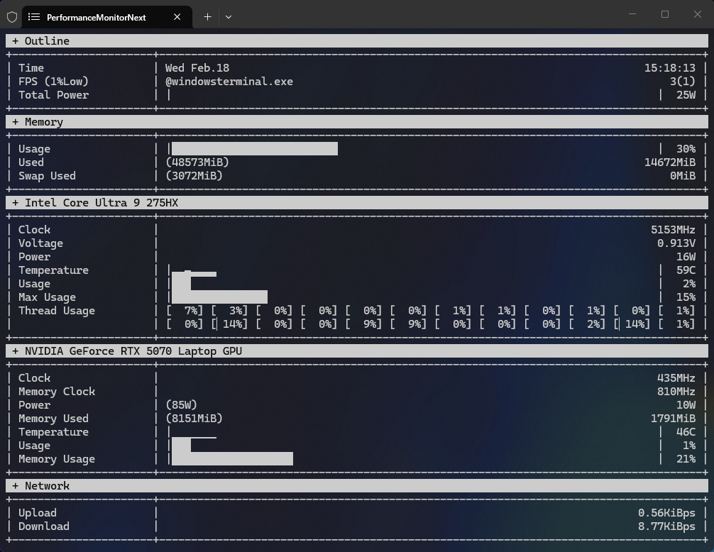
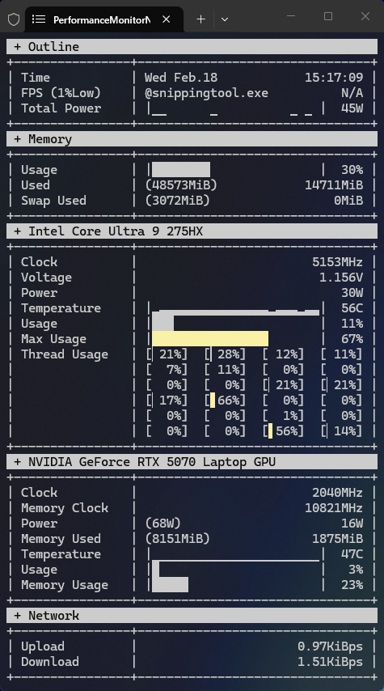

# Performance Monitor Next

A lightweight, real-time system performance monitor for Windows, built with Python.
It provides hardware and runtime metrics directly in your terminal or through an HTTP API.

## Features

- **CPU monitoring**: temperature, clock, usage, load, voltage, and power.
- **GPU monitoring**:
  - General GPU metrics via LibreHardwareMonitor.
  - NVIDIA GPU metrics via NVML.
- **Memory monitoring**: physical memory and swap usage.
- **Network monitoring**: real-time network activity.
- **Frame-time monitoring**: rendering/frame-time insights.
- **Live updates**: configurable refresh interval.
- **CLI + Server modes**: terminal dashboard or HTTP endpoint.

## Requirements

- **Operating system**: Windows (depends on `LibreHardwareMonitor` and `pythonnet`).
- **Python**: 3.11 or higher.
- **Permissions**: run as Administrator to access all hardware sensors.

## Installation

```bash
git clone https://github.com/LoHhhha/performance_monitor_next.git
cd performance_monitor_next
pip install .
```

## Quick Start

### Run as Terminal Dashboard

```bash
python -m performance_monitor.cmd.runner
```

Useful arguments:

- `-ft`, `--flush_time`: refresh interval in seconds (default: `0.8`).
- `--exclude-general-gpu`: disable general GPU monitoring.
- `--exclude-nvidia-gpu`: disable NVIDIA GPU monitoring.

Example:

```bash
python -m performance_monitor.cmd.runner -ft 1.0
```

### Run as HTTP Server

```bash
python -m performance_monitor.server.runner
```

Useful arguments:

- `-p`, `--port`: server port (default: `54321`).
- `--host`: host address (default: `127.0.0.1`).
- `--path`: metrics path (default: `/info`).

Example (serve at `http://127.0.0.1:8000/info`):

```bash
python -m performance_monitor.server.runner --host 127.0.0.1 -p 8000 --path /info
```

## Screenshots

The layout adapts automatically to terminal width.

<p align="center">
  
  
</p>

<p align="center"><em>Wide terminal view · Narrow terminal view</em></p>

## Troubleshooting

- **No sensor data / missing values**: run the terminal as Administrator.
- **GPU fields are empty**: ensure GPU drivers are installed and supported.
- **`pythonnet`/hardware access issues**: verify Python version and reinstall dependencies.

## Notes

- This project is Windows-focused by design due to hardware dependency constraints.
